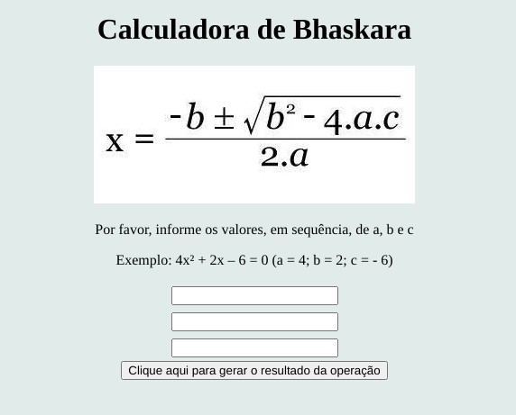

# Calculadora de Bhaskara
> A fórmula de Bhaskara é um cálculo matemático para determinar as raízes de uma função de segundo grau por meio de seus coeficientes.

Como metodologia de estudo, desenvolvi esse projeto simples como perspectiva prática para desenvolver as minhas hailidades com javascript, sem focar no CSS.

O projeto sofrerá atualizações conforme vou aprendendo de acordo com o meu progresso de estudo em javascript.

## Como utilizar

Basta fazer o download do projeto e abrir o index.html em qualquer navegador de sua preferência.
